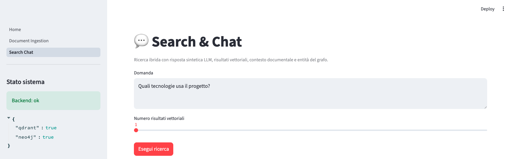

# KG-RAG Assistant

Hybrid Retrieval-Augmented Generation system combining:

- **Qdrant** for vector search
- **Neo4j** for Knowledge Graph storage
- **FastAPI** backend APIs
- **Streamlit** frontend UI
- local / pluggable LLM providers

---

# Features

## Document Ingestion

Upload PDF / TXT / Markdown files.

Pipeline:

1. Parse text
2. Chunk text with overlap
3. Generate embeddings
4. Store vectors in Qdrant
5. Create graph nodes in Neo4j
6. Extract entities and relations

## Hybrid Search

Query flow:

1. Embed user question
2. Semantic retrieval from Qdrant
3. Graph context retrieval from Neo4j
4. Final synthesized answer

### Search & Chat

<p align="center">
  
</p>

## UI

Built with Streamlit:

- Document upload page
- Search / Chat page
- Results inspection

---

# Tech Stack

- Python
- FastAPI
- Streamlit
- Qdrant
- Neo4j
- Docker Compose
- Pytest

---

# Run Locally

## Start databases

```bash
docker compose up -d
```
## Start backend

```bash
uvicorn app.main:app --reload --port 8000
```

## Start UI

```bash
streamlit run streamlit_app/Home.py --server.port 8501
```

## Create a Environment Variables

```bash
BACKEND_BASE_URL=http://localhost:8003

QDRANT_URL=http://localhost:6333
QDRANT_COLLECTION=documents

NEO4J_URI=bolt://localhost:7687
NEO4J_USERNAME=neo4j
NEO4J_PASSWORD=neo4jpassword
```
## Testing
```bash
python3 -m pytest -q
```
---
# Roadmap
-LLM-based entity extraction
-Graph visualization page
-Reranking layer
-Source citations
-Multi-document reasoning